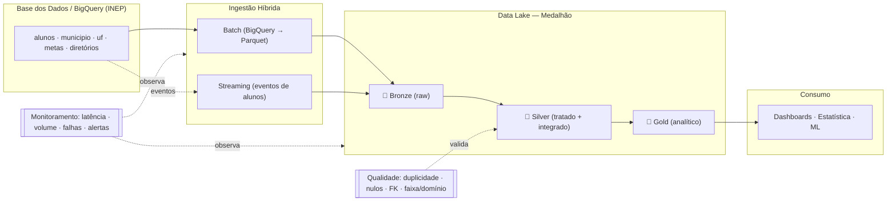

# Pipeline Híbrido para Análise da Alfabetização no Brasil

> **Tech Challenge — Fase 2 · FIAP** · Engenharia de Dados
> Pipeline híbrida (Batch + Streaming) sobre o **Indicador Criança Alfabetizada**,
> com Arquitetura Medalhão, qualidade de dados, monitoramento e FinOps.
> **Dados reais** do INEP obtidos via BigQuery (Base dos Dados).

---

## 1. Contexto do problema

A alfabetização na infância é um dos pilares do desenvolvimento educacional,
social e econômico do país. O **Compromisso Nacional Criança Alfabetizada** é a
política pública que mobiliza União, estados, DF e municípios para garantir que
**todas as crianças estejam alfabetizadas até o final do 2º ano** do ensino
fundamental, com meta de universalização até **2030**.

Em 2023, o **INEP** realizou a *Pesquisa Alfabetiza Brasil* e definiu o **ponto de
corte de 743 pontos** na escala de proficiência do **Saeb** — patamar a partir do
qual uma criança é considerada alfabetizada. Desse parâmetro nasce o **Indicador
Criança Alfabetizada**: o percentual de estudantes que atingem esse nível.

### O desafio educacional e o uso do indicador

O indicador permite responder: *quais municípios estão abaixo da meta? a evolução
recente aproxima o país de 100% em 2030? onde há maior desigualdade regional?*
Este projeto entrega a **camada de dados confiável** que sustenta essas análises.

**Fonte:** dataset `br_inep_avaliacao_alfabetizacao` na plataforma *Base dos Dados*
(nativo no BigQuery). São 7 tabelas + os diretórios de UF/Município:

| Tabela | Grão | Conteúdo |
|---|---|---|
| `alunos` | aluno (3,87 mi) | microdado: proficiência, alfabetizado, peso amostral, rede |
| `municipio` / `uf` | local × ano × rede | indicador oficial: `taxa_alfabetizacao`, `media_portugues` |
| `meta_alfabetizacao_{brasil,uf,municipio}` | local × ano | trajetória de metas 2024–2030 |
| `dicionario` | — | decodificação de `rede`, `serie`, `alfabetizado` |

---

## 2. Arquitetura proposta

Arquitetura **híbrida** com **Medalhão** (Bronze → Silver → Gold):

- **Ingestão Batch** — tabelas históricas (indicadores, metas, dimensões).
- **Ingestão Streaming** — eventos near-real-time (novas medições de alunos), simulando Pub/Sub.
- **Bronze** — dados brutos + metadados de ingestão.
- **Silver** — limpo, tipado, chaves normalizadas, códigos decodificados e **bases integradas**.
- **Gold** — datasets analíticos prontos para dashboards, estatística e ML.

### Diagrama da pipeline



Detalhes, modelo de dados e mapeamento **Local ↔ GCP**: [`docs/arquitetura.md`](docs/arquitetura.md).

### Fluxo de dados
`BigQuery → data/real (Parquet) → Bronze (raw) → Silver (limpo/integrado/validado) → Gold (analítico) → Dashboards/ML`

---

## 3. Tecnologias utilizadas e justificativa

| Ferramenta | Papel | Por que |
|---|---|---|
| **Python 3.14** | linguagem base | ecossistema de dados, portabilidade |
| **google-cloud-bigquery** | ingestão da fonte real | lê o dataset público direto do BigQuery |
| **Polars** | transformações Silver/Gold | DataFrame vetorizado, multi-thread; processa 3,9 mi de linhas em segundos |
| **DuckDB** | motor analítico/SQL | OLAP *single-node* sobre Parquet, sem servidor |
| **PyArrow + Parquet/ZSTD** | armazenamento | colunar, comprimido, particionável (FinOps) |
| **Terraform** | IaC (GCP) | infraestrutura versionada |
| **GCP** | BigQuery · GCS · Pub/Sub | *Base dos Dados é nativa no BigQuery* → menor atrito |

> **Por que não Spark?** Para ~4 mi de linhas, um motor vetorizado single-node
> resolve em segundos, **sem cluster** (ver *Decisões* e FinOps).

---

## 4. Decisões arquiteturais (trade-offs)

**Batch vs Streaming** — Indicadores/metas/dimensões mudam com baixa frequência ⇒
**batch**. Novas medições de alunos chegam continuamente ⇒ **streaming** em
micro-batches. As duas trilhas convergem na Bronze e se unificam na Silver.

**Data Lake vs Data Warehouse** — **Ambos, em camadas**: *lake* (GCS/Parquet) para
Bronze/Silver (barato, histórico bruto) e *warehouse* (BigQuery) para a Gold (BI
rápido). Evita custo de subir dados crus/transitórios ao warehouse.

**Custo vs Performance** — **DuckDB/Polars em vez de Spark**: processa os microdados
em segundos, sem cluster ocioso nem overhead de JVM. Roda num laptop e custa
**poucos dólares/mês** na nuvem.

**Qual "rede" é o indicador oficial** — os dados vêm quebrados por rede de ensino.
A rede `Total` quase não é preenchida; a **meta nacional é definida para a rede
Pública**. Por isso o indicador headline usa **Pública (Estadual+Municipal)**,
coerente com a meta.

---

## 5. Qualidade de dados

Regras em `src/quality/`, aplicadas na transição Bronze→Silver (*fail-fast*;
relatórios em `monitoring/quality/`):

- **Duplicidade** — PKs únicas (`id_aluno×ano`; `ano×local×serie×rede`).
- **Valores ausentes** — ratio de nulos por coluna (proficiência é nula p/ ausentes — tratado, não é erro).
- **Chaves de relacionamento (FK)** — integridade aluno → município → UF.
- **Faixa/Domínio** — proficiência ∈ [0,1000]; taxa ∈ [0,100]; `alfabetizado` ∈ {0,1}.

**Validação cruzada (destaque):** o dataset `gold/validacao_microdado` **reagrega os
3,9 mi de microdados de alunos** e compara com a `taxa_alfabetizacao` oficial —
diferença média de **~0,2 ponto percentual** em 10,4 mil municípios×ano,
confirmando a consistência ponta-a-ponta.

> Documentação detalhada dos scripts de validação — as 5 verificações, onde cada
> uma é aplicada (tabela a tabela), o bloqueio *fail-fast* e a auditoria em JSON:
> [`docs/qualidade.md`](docs/qualidade.md).

---

## 6. Monitoramento e FinOps

**Monitoramento** (`src/monitoring/`): cada etapa registra **volume, latência,
status e alertas**; um JSON por execução em `monitoring/metrics/`.

**FinOps**: Parquet+ZSTD, particionamento, Gold materializada, motor single-node,
lifecycle no GCS. Estimativa **~3–5 USD/mês** (ver [`docs/finops.md`](docs/finops.md)).
A ingestão via BigQuery fica no **free tier** (1 TB de consulta/mês).

---

## 7. Aplicação em IA

A camada **Gold** (`gold/ml_features`, uma linha por município × ano) está pronta para:
- **Predição** do `taxa_alfabetizacao` do próximo ciclo (usa taxa do ano anterior, média de proficiência, gap vs meta);
- **Análise de desigualdade** — *clustering* de municípios por vulnerabilidade;
- **Políticas públicas** — priorização dos municípios mais distantes da meta 2030.

**Demonstração prática:** [`notebooks/insights.ipynb`](notebooks/insights.ipynb) —
9 análises sobre a Gold. Além do panorama, ranking, desigualdade e proficiência,
o bloco de IA traz: **predição** da taxa do próximo ciclo (regressão);
**comparação de modelos com validação cruzada** (baseline · Regressão Linear ·
Random Forest · Gradient Boosting) — a régua honesta; **classificação de risco**
("vai bater a meta?") com matriz de confusão e ROC-AUC, que gera uma **lista de
priorização** exportável ([`notebooks/priorizacao_risco.csv`](notebooks/priorizacao_risco.csv));
**projeção 2030** por UF; e **clusterização** de vulnerabilidade (K-Means, 4
perfis). Gráficos em `notebooks/figs/`. Requer `matplotlib` e `scikit-learn`.

---

## 8. Como executar

```bash
# 1) Ambiente
python -m venv .venv
.venv/Scripts/python -m pip install -r requirements.txt   # Windows

# 2) Baixar os dados reais do BigQuery (1x) — requer credencial GCP
#    (Service Account key OU gcloud auth application-default login)
export GOOGLE_APPLICATION_CREDENTIALS=caminho/para/gcp-key.json
.venv/Scripts/python -m src.pipeline download --project SEU_PROJETO_GCP

# 3) Pipeline completo (bronze → streaming → silver → gold → report)
.venv/Scripts/python -m src.pipeline run-all

# etapas individuais: ingest-batch | stream | silver | gold | report
# 4) Testes
.venv/Scripts/python -m unittest discover -s tests -v
```

> A credencial e os dados ficam em `data/` (no `.gitignore`) — **nunca** vão ao repositório.

### Modo cloud-native (lake direto no GCS)

Com `--cloud` (ou `LAKE_MODE=gcs`), o **mesmo pipeline** lê e grava as camadas
Bronze/Silver/Gold **diretamente nos buckets GCS** via `fsspec/gcsfs` — sem
etapa de upload posterior. A publicação no BigQuery então carrega as tabelas
**direto das URIs `gs://`** (`load_table_from_uri`): zero re-upload e zero
tráfego local (FinOps).

```bash
export GOOGLE_APPLICATION_CREDENTIALS=caminho/para/gcp-key.json

# pipeline inteiro rodando contra o data lake na nuvem
.venv/Scripts/python -m src.pipeline --cloud run-all

# BigQuery: datasets alfabetizacao_gold + alfabetizacao_silver a partir do GCS
.venv/Scripts/python -m src.publish.gcp --cloud --project SEU_PROJETO_GCP --only bigquery
```

No modo local, `src.publish.gcp` continua fazendo o caminho clássico
"processa local, publica na nuvem" (upload dos Parquet + load via DataFrame).
A landing zone (`data/real`) e o tópico de streaming simulado permanecem
locais por definição — são a fronteira com a fonte.

### Execução 100% na nuvem (Cloud Run Job)

O mesmo container roda o pipeline inteiro **dentro da GCP** (serverless, paga
por minuto de execução): download da fonte pública → Medalhão direto no GCS →
BigQuery. Deploy e execução em [`docs/cloudrun.md`](docs/cloudrun.md):

```bash
gcloud run jobs deploy alfabetizacao-pipeline --source . --region us-central1 \
  --cpu 2 --memory 4Gi --set-env-vars GCP_PROJECT_ID=SEU_PROJETO \
  --service-account SA_DO_PIPELINE@SEU_PROJETO.iam.gserviceaccount.com
gcloud run jobs execute alfabetizacao-pipeline --region us-central1 --wait
```

### Deploy opcional na GCP
```bash
cd infra/terraform && cp terraform.tfvars.example terraform.tfvars   # preencha project_id
terraform init && terraform apply
```

---

## 9. Estrutura do repositório

```
.
├── README.md
├── requirements.txt
├── Dockerfile                     # imagem do pipeline p/ Cloud Run Job
├── config/settings.yaml           # configuração central (sem segredos)
├── docs/                          # documentação técnica (ver abaixo)
│   ├── arquitetura.md             # arquitetura, diagrama, modelo de dados, mapeamento Local↔GCP
│   ├── qualidade.md               # scripts de validação e qualidade de dados
│   ├── finops.md                  # otimização de custos e estimativa
│   └── cloudrun.md                # deploy/execução serverless na GCP
├── infra/terraform/               # IaC GCP (GCS, BigQuery, Pub/Sub)
├── scripts/                       # scripts utilitários (apoio ao pipeline)
│   ├── bq_download.py             # baixa as tabelas reais do BigQuery → data/real
│   └── cloud_run_job.sh           # entrypoint do Cloud Run Job (download→run-all→publish)
├── notebooks/insights.ipynb       # análises e demonstrações de IA sobre a Gold
├── src/
│   ├── pipeline.py                # orquestrador (CLI)
│   ├── common/                    # config, IO do lake, logging
│   ├── ingestion/                 # batch.py, streaming.py
│   ├── transform/                 # silver.py, gold.py  (Medalhão)
│   ├── quality/                   # regras de qualidade de dados
│   ├── publish/                   # publicação GCS + BigQuery
│   └── monitoring/                # métricas, latência, alertas
├── tests/                         # testes de qualidade + e2e
├── data/                          # data lake + credenciais (fora do git)
└── monitoring/                    # métricas e relatórios (gerados)
```

### Documentação técnica (`docs/`)

| Arquivo | Conteúdo |
|---|---|
| [`docs/arquitetura.md`](docs/arquitetura.md) | Arquitetura da solução, diagrama da pipeline, modelo de dados (Gold) e mapeamento Local ↔ GCP |
| [`docs/qualidade.md`](docs/qualidade.md) | Scripts de validação: as 5 verificações, onde cada uma é aplicada, *fail-fast* e auditoria |
| [`docs/finops.md`](docs/finops.md) | Otimização de custos (Parquet, particionamento, single-node) e estimativa mensal |
| [`docs/cloudrun.md`](docs/cloudrun.md) | Deploy e execução do pipeline 100% na nuvem (Cloud Run Job) + agendamento |

---

## 10. Principais resultados (dados reais)

- **Indicador nacional (rede Pública):** 55,9% (2023) → 59,2% (2024) → 66,0% (2025).
- **Liderança estadual (2024):** Ceará (**85,3%**), seguido de Goiás, Minas Gerais e Espírito Santo.
- **Consistência:** microdados reagregados batem com o indicador oficial (~0,2 p.p.).
