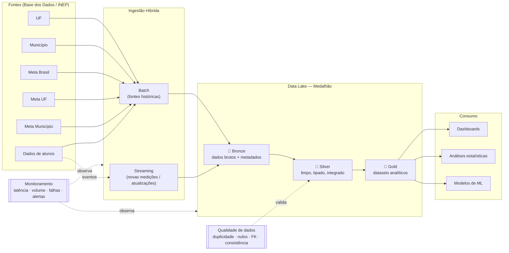

# Arquitetura da Solução

## Visão geral

Pipeline **híbrido (batch + streaming)** que integra fontes do indicador de
alfabetização seguindo a **Arquitetura Medalhão** (Bronze → Silver → Gold),
com qualidade de dados, observabilidade e FinOps.

O código roda **localmente** (data lake em `data/`, Parquet particionado) e é
**projetado para GCP** — cada componente local tem equivalente de nuvem
provisionável via Terraform (`infra/terraform/`).

## Diagrama da pipeline

## Fluxo de dados

0. **Landing / Raw** (`data/real/`): Parquet exatamente como vem do BigQuery — bytes
   da origem, **sem nenhum tratamento**.
1. **Ingestão batch → Bronze** (`src/ingestion/batch.py`): tratamento **mínimo** —
   materializa no formato Parquet do lake e adiciona metadados de auditoria
   (`_ingested_at`, `_source`, `_ingestion_type`). Sem lógica de negócio.
2. **Ingestão streaming** (`src/ingestion/streaming.py`): um produtor publica
   novos eventos de medição de alunos num tópico (JSONL simulando Pub/Sub); o
   consumidor processa em **micro-batches** e persiste em `bronze/alunos_stream`,
   medindo latência.
3. **Silver** (`src/transform/silver.py`): limpeza, tipagem, decodificação de
   códigos (dicionário), normalização de chaves, deduplicação, tratamento de
   ausentes, **integração** de batch+streaming e de fatos+dimensões, e **validação
   de qualidade** (fail-fast em falhas bloqueantes).
4. **Gold** (`src/transform/gold.py`): indicador oficial (rede Pública) por
   município/UF/Brasil, comparação **meta vs resultado**, evolução temporal,
   **validação microdado × oficial** e tabela de **features para ML**.

## Modelo de dados (Gold)

| Dataset | Grão | Uso |
|---|---|---|
| `indicador_municipio` | município × ano | dashboard municipal, mapa de calor |
| `indicador_uf` | UF × ano | ranking estadual, comparação regional |
| `indicador_brasil` | ano | KPI nacional vs meta 2030 |
| `evolucao_temporal` | UF × ano | séries temporais (variação YoY) |
| `validacao_microdado` | município × ano | qualidade: microdado reagregado vs taxa oficial |
| `ml_features` | município × ano | treino de modelos preditivos |

Regra de negócio central: aluno **alfabetizado** quando `proficiencia >= 743`
(ponto de corte oficial do Saeb — Pesquisa Alfabetiza Brasil, 2023). O indicador
consolidado usa a **rede Pública (Estadual+Municipal)**, coerente com a meta nacional.

Fonte real: dataset `br_inep_avaliacao_alfabetizacao` (BigQuery / Base dos Dados),
baixado via `scripts/bq_download.py` para `data/real/` (Parquet).

## Mapeamento Local ↔ GCP

| Componente | Local | GCP |
|---|---|---|
| Data lake | `data/{bronze,silver,gold}` (Parquet) | GCS (3 buckets) |
| Ingestão batch | job Python (`ingest_batch`) | Cloud Run / Dataproc + Cloud Scheduler |
| Streaming | JSONL + consumidor | Pub/Sub + Dataflow/Cloud Function |
| Camada analítica | Parquet Gold | BigQuery (external/native tables) |
| Monitoramento | logs + JSON de métricas | Cloud Logging + Cloud Monitoring |
| Orquestração | CLI `src/pipeline.py` | Cloud Composer (Airflow) |
| Qualidade | `src/quality` | mesmo código + testes no CI |
