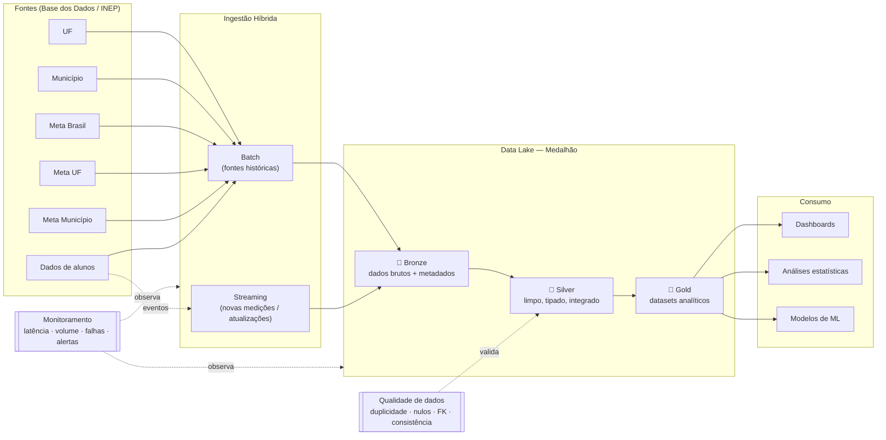

# Arquitetura da Solução

## Visão geral

Pipeline **híbrido (batch + streaming)** que integra fontes do indicador de
alfabetização seguindo a **Arquitetura Medalhão** (Bronze → Silver → Gold),
com qualidade de dados, observabilidade e FinOps.

O código roda **localmente** (data lake em `data/`, Parquet particionado) e é
**projetado para GCP** — cada componente local tem equivalente de nuvem
provisionável via Terraform (`infra/terraform/`).

## Diagrama da pipeline

## Fluxo de dados

1. **Ingestão batch** (`src/ingestion/batch.py`): lê a landing zone (CSV) e grava
   na **Bronze** em Parquet, sem transformações, adicionando metadados
   (`_ingested_at`, `_source_file`, `_ingestion_type`).
2. **Ingestão streaming** (`src/ingestion/streaming.py`): um produtor publica
   eventos em um tópico (arquivo JSONL simulando Pub/Sub); o consumidor processa
   em **micro-batches** e persiste em `bronze/indicador_stream`, medindo latência.
3. **Silver** (`src/transform/silver.py`): limpeza, tipagem, normalização de
   chaves, deduplicação, tratamento de nulos, **integração** de batch+streaming e
   de fatos+dimensões, e **validação de qualidade** (fail-fast em falhas
   bloqueantes).
4. **Gold** (`src/transform/gold.py`): agrega o indicador por município/UF/Brasil,
   compara **meta vs resultado**, calcula **evolução temporal** e monta uma tabela
   de **features para ML**.

## Modelo de dados (Gold)

| Dataset | Grão | Uso |
|---|---|---|
| `indicador_municipio` | município × ano | dashboard municipal, mapa de calor |
| `indicador_uf` | UF × ano | ranking estadual, comparação regional |
| `indicador_brasil` | ano | KPI nacional vs meta 2030 |
| `evolucao_temporal` | UF × ano | séries temporais (variação YoY) |
| `ml_features` | município × ano | treino de modelos preditivos |

Regra de negócio central: aluno **alfabetizado** quando `proficiencia >= 743`
(ponto de corte oficial do Saeb — Pesquisa Alfabetiza Brasil, 2023).

## Mapeamento Local ↔ GCP

| Componente | Local | GCP |
|---|---|---|
| Data lake | `data/{bronze,silver,gold}` (Parquet) | GCS (3 buckets) |
| Ingestão batch | job Python (`ingest_batch`) | Cloud Run / Dataproc + Cloud Scheduler |
| Streaming | JSONL + consumidor | Pub/Sub + Dataflow/Cloud Function |
| Camada analítica | Parquet Gold | BigQuery (external/native tables) |
| Monitoramento | logs + JSON de métricas | Cloud Logging + Cloud Monitoring |
| Orquestração | CLI `src/pipeline.py` | Cloud Composer (Airflow) |
| Qualidade | `src/quality` | mesmo código + testes no CI |
